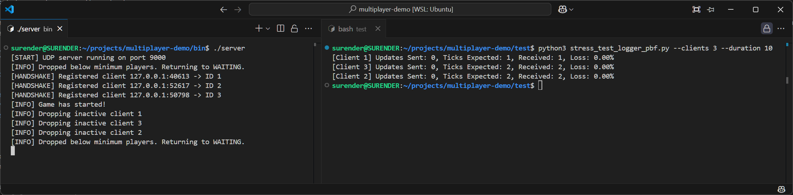
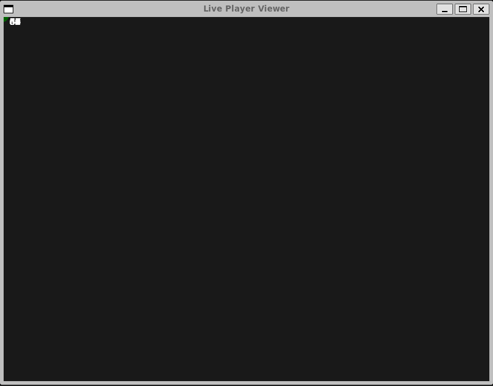
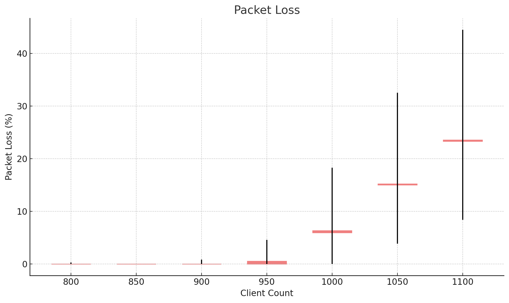
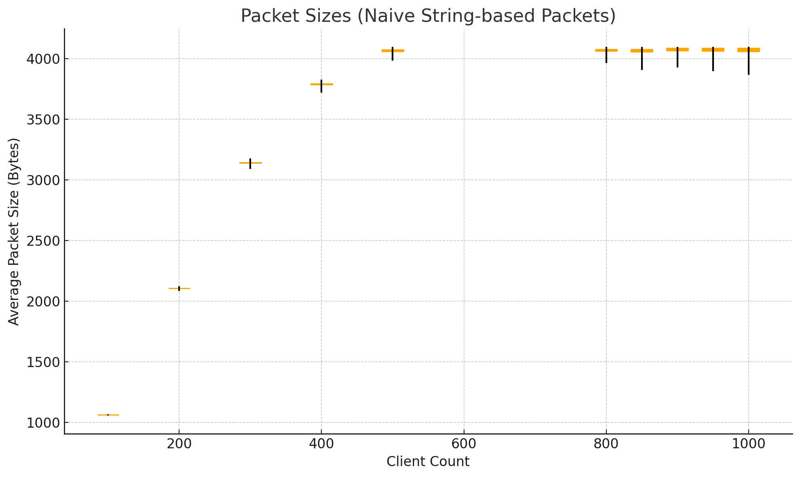

# Multiplayer UDP Game Simulation and Stress Testing

## Overview

This project simulates a real-time multiplayer game server using UDP sockets, focusing on network state synchronization, packet handling, and performance under high concurrency. A custom protocol enables clients to join, exchange position updates, and receive periodic world state broadcasts tagged with a server-side tick. The project includes a stress test framework that simulates up to 1000 clients to analyze packet loss and message throughput.

The implementation is optimized for clarity and performance, using multithreading to handle concurrent client updates and regular broadcasts. A visual GUI was recently added to display live player movements in real time. The server now also supports **authoritative collision detection**, preventing players from overlapping or getting too close.





## Architecture

* **Language**: C++ for the server, Python for the stress test clients.
* **Transport Protocol**: UDP (no built-in reliability, packet ordering, or retransmission).
* **Serialization**: Protobuf (current), String-based (legacy).

### Server:

* Listens for client connections on port 9000.
* Handles initial handshakes via `HELLO` / `WELCOME:<id>`.
* Maintains a tick counter, incremented every 100ms.
* Broadcasts current game state to all clients on every tick.
* Uses Protobuf for structured, compact messages.
* Performs server-side collision detection to ensure no two players are within a fixed radius.

### Client (Stress Test):

* Spawns multiple threads simulating different clients.
* Each client sends position updates every 100ms and listens for `STATE_PACKET` messages.
* Tracks tick coverage to compute packet loss.

### Visualizer:

* Live GUI built using `pygame` displays real-time player movements.
* Dots on the screen represent each player, dynamically scaled with window size.
* Shows accurate positions based on server broadcasts.
* Automatically removes disconnected clients from view.

## Features Implemented

* Stateless UDP handshake and ID assignment.
* Tick-based simulation loop (100ms interval).
* Server broadcasts include a tick tag to measure delivery accuracy.
* Multithreaded stress test clients with loss detection metrics.
* Command-line configuration for test duration and client count.
* Protobuf-based communication greatly reduces packet size compared to legacy string-based payloads.
* GUI visualizer to track live movement of all players.
* Authoritative server with basic collision prevention using Euclidean distance.

## Legacy Protocol (String-Based)

The earlier version of the project used naive string formatting for communication:

* Format: `GAME:STATE:TICK=1234;ID=1:X=100:Y=200;ID=2:X=120:Y=230;...`
* Simple and readable, but highly inefficient beyond ~800 clients.
* Susceptible to large packet sizes and string parsing overhead.

## Migration to Protobuf

* **New Format**: Fully defined `game.proto` schema for structured messages.
* **Benefit**: Protobuf reduced packet size by over 60% in tests with 1000 clients.
* **Integration**: Replaced manual parsing with compiled Protobuf message handling.

## 📊 Network Performance Graphs

### 1. Packet Loss vs Client Count



This chart visualizes the relationship between client concurrency and packet loss during server broadcasts. Each red bar represents the *mean packet loss* across all clients for a given client count, and the black whiskers indicate the *minimum and maximum loss observed*.

- *Below 800 clients*: Packet loss is negligible (≈ 0%).
- *Between 900–1000 clients*: Loss increases modestly.
- *1050+ clients*: Some clients experience >30% loss, suggesting socket buffer saturation or exceeding the network interface's capacity.

### 2. Broadcast Packet Size vs Client Count (Legacy)



This plot shows how the *average packet size (in bytes)* increases using the legacy string format.

- Packets exceed *4000 bytes* around 900 clients.
- Leads to fragmentation and loss beyond safe MTU (~1472 bytes for IPv4).

> 🧠 *Insight*: Switching to Protobuf helped reduce this bloat significantly and improved network stability.

## Future Work

* Add reliable delivery via selective retransmission.
* Add gameplay logic: health, shooting, and kill zones.
* Server-side collision resolution (currently basic, expand to spatial indexing).
* GUI enhancements: player trails, stats, disconnect indicators.
* Replace Python clients with C++ ones for better performance.
* Optional: WebSocket gateway for browser-based frontends.

## How to Run

### Server:
```bash
cd server
make
./server
```

### Stress Test:
```bash
cd test
python3 threaded_stress_test.py --clients 100 --duration 10
```

### Visualizer:
```bash
cd viewer
python3 viewer.py
```

## Notes

* Protobuf `.proto` schema is in `game.proto`.
* The compiled Protobuf classes are generated with:
```bash
protoc --cpp_out=./generated --python_out=./test game.proto
```
* Tested up to 1200 clients on a modern machine (i7/16GB).
